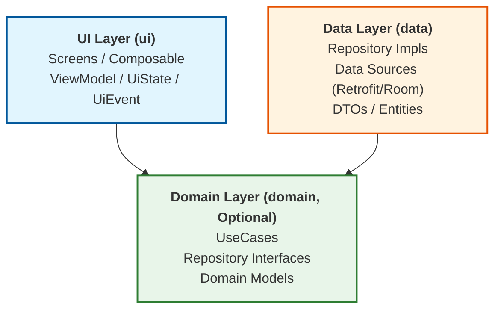

# Android 单 Module + 包内 Clean 架构实战规范 (Android Clean Architecture Skill)

本 Skill 专为 **Android 项目开发** 制定，旨在为 2～3 人中小型 Android 开发团队提供一套**高性价比、低维护成本、严谨且符合 Android 官方指导思想 (Modern Android Architecture)** 的 Clean 架构落地规范。

---

## 一、架构核心哲学与理论基础

### 1. 核心结论
- **Clean Architecture ≠ 多 Module**：Clean 架构解决的是**依赖方向与职责边界**问题，而非工程 Module 的数量。
- **Feature-First + Package Boundary**：以**业务功能 (Feature)** 做代码聚合，在 Feature 内部使用**包 (Package)** 做 Clean 分层隔离 (`ui`, `domain`, `data`)。
- **依赖倒置原则 (DIP)**：UI → Domain ← Data。Domain 是核心，不依赖 Data 或具体技术框架 (Retrofit, Room, DataStore)；Data 是具体实现，依赖 Domain 的接口契约；UI 层依赖 Domain 契约展现数据。
- **实用主义分层 (Pragmatic Clean)**：坚决反对形式主义 Clean。禁止为了架构规范而无脑堆砌无业务逻辑的透传 UseCase 和冗余的 DataSource 接口。
- **包即未来的 Module**：清晰的包边界是未来随着团队扩大（5+人）或编译耗时增加时平滑拆分 Gradle Submodule 的天然候选边界。

---

## 二、与 Android 官方 Modern Android Architecture 对齐

Android 官方推荐将 Android 应用架构划分为三大主层：



1. **UI Layer (`ui`)**：
   - 负责向屏幕展示数据并响应用户交互（包含 Screen/Composable、ViewModel、UiState、UiEvent）。
   - 遵循 Android 官方单向数据流 (Unidirectional Data Flow, UDF)。
   - ViewModel 驱动 `UiState` (StateFlow)，仅依赖 Domain 层的 UseCases 或 Repository 接口。
2. **Domain Layer (`domain`)**：
   - 封装 Android 业务逻辑，作为 UI 和 Data 之间的纽带。
   - 纯 Kotlin 实现，零 Android 框架依赖（避免使用 `Context`, `View` 等）。
   - 包含：Domain Models、Repository Interfaces、UseCases。
3. **Data Layer (`data`)**：
   - 负责从网络、数据库、本地存储获取和持久化数据。
   - 实现 Domain 层定义的 Repository 接口。
   - 包含：Repository Impls、Data Sources (Retrofit API, Room DAO, DataStore)、Data Models (DTO, Entity)、Mappers。

---

## 三、标准 Android 项目目录结构规范

推荐 Android 项目按 **Core（基础设施）** 与 **Feature（业务功能）** 进行顶层划分，业务功能内部按 Clean 划分 `ui`, `domain`, `data` 包。

```text
app/src/main/java/com/sample/app/
│
├── core/                           # 跨 Feature 通用基础库 / 基础设施
│   ├── network/                    # Retrofit 实例、HTTP 拦截器、网络状态监听
│   ├── database/                   # RoomDatabase 基础配置、Converters
│   ├── datastore/                  # UserPreferences / DataStore 管理器
│   └── common/                     # 基础基类、协程 DispatcherProvider、Result 封装、扩展函数
│
└── feature/                        # 业务功能模块 (按 Feature 聚合)
    ├── login/                      # 登录业务 Feature
    │   ├── ui/                     # Android UI 层 (Screen/Composable, ViewModel, UiState)
    │   │   ├── LoginScreen.kt      # Compose 页面 / Activity / Fragment
    │   │   ├── LoginViewModel.kt   # UI 状态持有者
    │   │   ├── LoginUiState.kt     # 页面 UI 状态定义 (data class / sealed interface)
    │   │   └── LoginUiEvent.kt     # 页面一次性事件 (sealed interface)
    │   │
    │   ├── domain/                 # Domain 层 (业务契约与核心逻辑)
    │   │   ├── LoginUseCase.kt     # 登录组合业务逻辑 (仅复杂流程时使用)
    │   │   ├── UserRepository.kt   # 接口！定义 Domain 对数据的需求
    │   │   └── model/              # Domain 领域模型
    │   │       ├── User.kt
    │   │       └── AuthToken.kt
    │   │
    │   └── data/                   # Data 层 (具体实现)
    │       ├── UserRepositoryImpl.kt# Repository 接口实现
    │       ├── datasource/         # 数据源 (API 接口 / DAO / DataStore)
    │       │   └── LoginApi.kt
    │       ├── model/              # 数据传输模型 / 持久化实体
    │       │   ├── UserDto.kt
    │       │   └── UserEntity.kt
    │       └── mapper/             # 数据转换器
    │           └── UserMapper.kt   # Dto/Entity <-> Domain Model 转换
    │
    └── profile/                    # 个人中心 Feature (结构同 login)
        ├── ui/
        ├── domain/
        └── data/
```

---

## 四、分层职责与依赖硬约束

### 1. 包导入禁令 (Import Boundaries)

| 所在包 (Directory) | 允许 `import` 的包 | 绝对禁止 `import` 的包 | 说明 |
| :--- | :--- | :--- | :--- |
| `feature/x/domain` | `core/common`<br/>同包及其他 feature 的 `domain` | `feature/x/data` <br/> `feature/x/ui`<br/>`android.*` (除基础 Annotation) | Domain 必须独立，纯 Kotlin，不依赖实现层与 Android 框架 |
| `feature/x/ui` | `feature/x/domain`<br/>`core/*` | `feature/x/data` | UI ViewModel 只能认识 Domain 接口/UseCase，不能直接依赖 Data 实现 |
| `feature/x/data` | `feature/x/domain`<br/>`core/*` | `feature/x/ui` | Data 实现 Domain 接口，并使用底层库 (Retrofit/Room) |

> 💡 **Android 架构审查规则**：若在 `domain` 包中发现 `import com.sample.app.feature.login.data.*` 或 `import retrofit2.*`，直接判定为架构违规 (Architecture Violation)！

---

## 五、规范代码实现范例 (Android Kotlin)

### 1. Domain 层：定义 Model & Repository 接口 & UseCase

```kotlin
// feature/login/domain/model/User.kt
package com.sample.app.feature.login.domain.model

data class User(
    val id: String,
    val username: String,
    val avatarUrl: String,
    val isVip: Boolean
)

// feature/login/domain/UserRepository.kt
package com.sample.app.feature.login.domain

import com.sample.app.feature.login.domain.model.User

interface UserRepository {
    suspend fun login(username: String, password: String): Result<User>
    suspend fun saveSessionToken(token: String)
    suspend fun getLocalUser(): User?
}

// feature/login/domain/LoginUseCase.kt
package com.sample.app.feature.login.domain

import com.sample.app.feature.login.domain.model.User

class LoginUseCase(
    private val userRepository: UserRepository
) {
    suspend operator fun invoke(username: String, password: String): Result<User> {
        if (username.isBlank() || password.length < 6) {
            return Result.failure(IllegalArgumentException("用户名或密码格式不正确"))
        }
        val loginResult = userRepository.login(username, password)
        return loginResult.onSuccess { user ->
            // 登录成功后的持久化/初始化业务逻辑
        }
    }
}
```

---

### 2. Data 层：实现 Repository & DTO & Mapper

```kotlin
// feature/login/data/model/UserDto.kt
package com.sample.app.feature.login.data.model

import com.sample.app.feature.login.domain.model.User
import kotlinx.serialization.SerialName
import kotlinx.serialization.Serializable

@Serializable
data class UserDto(
    @SerialName("user_id") val userId: String,
    @SerialName("user_name") val userName: String,
    @SerialName("avatar") val avatar: String?,
    @SerialName("vip_status") val vipStatus: Int
)

fun UserDto.toDomain(): User {
    return User(
        id = userId,
        username = userName,
        avatarUrl = avatar ?: "",
        isVip = vipStatus == 1
    )
}

// feature/login/data/UserRepositoryImpl.kt
package com.sample.app.feature.login.data

import com.sample.app.feature.login.data.datasource.LoginApi
import com.sample.app.feature.login.data.model.toDomain
import com.sample.app.feature.login.domain.UserRepository
import com.sample.app.feature.login.domain.model.User
import kotlinx.coroutines.CancellationException

class UserRepositoryImpl(
    private val api: LoginApi
) : UserRepository {

    override suspend fun login(username: String, password: String): Result<User> {
        return try {
            val userDto = api.login(username, password)
            Result.success(userDto.toDomain())
        } catch (e: CancellationException) {
            throw e // Android 协程规范：必须重新抛出 CancellationException
        } catch (e: Exception) {
            Result.failure(e)
        }
    }

    override suspend fun saveSessionToken(token: String) {}
    override suspend fun getLocalUser(): User? = null
}
```

---

### 3. Android UI 层 (`ui`)：ViewModel & UI State

```kotlin
// feature/login/ui/LoginUiState.kt
package com.sample.app.feature.login.ui

import com.sample.app.feature.login.domain.model.User

sealed interface LoginUiState {
    object Idle : LoginUiState
    object Loading : LoginUiState
    data class Success(val user: User) : LoginUiState
    data class Error(val message: String) : LoginUiState
}

// feature/login/ui/LoginViewModel.kt
package com.sample.app.feature.login.ui

import androidx.lifecycle.ViewModel
import androidx.lifecycle.viewModelScope
import com.sample.app.feature.login.domain.LoginUseCase
import kotlinx.coroutines.flow.MutableStateFlow
import kotlinx.coroutines.flow.StateFlow
import kotlinx.coroutines.flow.asStateFlow
import kotlinx.coroutines.launch

class LoginViewModel(
    private val loginUseCase: LoginUseCase
) : ViewModel() {

    private val _uiState = MutableStateFlow<LoginUiState>(LoginUiState.Idle)
    val uiState: StateFlow<LoginUiState> = _uiState.asStateFlow()

    fun login(username: String, password: String) {
        viewModelScope.launch {
            _uiState.value = LoginUiState.Loading
            loginUseCase(username, password)
                .onSuccess { user ->
                    _uiState.value = LoginUiState.Success(user)
                }
                .onFailure { error ->
                    _uiState.value = LoginUiState.Error(error.message ?: "登录失败")
                }
        }
    }
}
```

---

## 六、Android 架构审查与反模式清单 (Code Review Checklist)

- [ ] **[Skill 标识]** 是否遵循 `android-single-module-clean-architecture` 命名与规范？
- [ ] **[依赖违规]** `domain` 包下是否有导入 `data` 或 `ui` 包的代码？
- [ ] **[依赖违规]** `ui` ViewModel 是否注入了 `UserRepositoryImpl` 而不是 `UserRepository` 接口？
- [ ] **[形式主义]** 是否存在只是简单调用 `repository.getXxx()` 的无意义 `UseCase`？
- [ ] **[模型污染]** API 返回的 DTO（如 `UserDto`）或 Room `@Entity` 是否直接透传到了 UI / Compose 页面？
- [ ] **[Android 协程]** Repository 中捕获异常时，是否遗漏了 `catch (e: CancellationException) { throw e }`？

---

## 七、未来演进：从 Package 平滑迁移至 Multi-Module (Gradle)

```text
Android 演进路径：
app/src/main/java/com/sample/app/feature/login/
  ├── ui/
  ├── domain/
  └── data/

                 ▼ 平滑迁移为 Gradle Submodules

:feature:login
  ├── :feature:login:ui     (dependsOn :domain)
  ├── :feature:login:domain (pure kotlin, zero dependencies)
  └── :feature:login:data   (dependsOn :domain)
```
